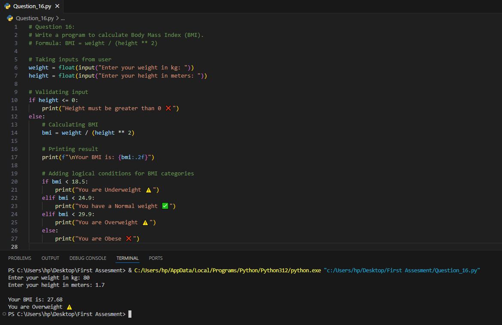
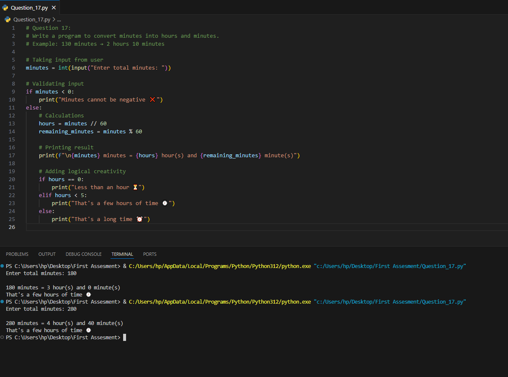

# AI Full Stack Developer - Python Basics Assignment

This repository contains solutions for **17 beginner-level Python questions**.  
Each question demonstrates the use of `print`, `input`, arithmetic operations, and logical conditions.  

---

## 📂 Questions & Solutions

### Question 1: Temperature Converter (Celsius → Fahrenheit)
**Formula:** Fahrenheit = (Celsius × 9/5) + 32  
📄 [View Code](Question_1.py)  
🖼️ Output:  

---

### Question 2: Area of a Rectangle
📄 [View Code](Question_2.py)  
🖼️ Output:  

---

### Question 3: Compound Interest
**Formula:** CI = P × (1 + R/100)^T – P  
📄 [View Code](Question_3.py)  
🖼️ Output:  

---

### Question 4: Perimeter of a Rectangle
📄 [View Code](Question_4.py)  
🖼️ Output:  

---

### Question 5: Average of Three Numbers
📄 [View Code](Question_5.py)  
🖼️ Output:  

---

### Question 6: Square and Cube of a Number
📄 [View Code](Question_6.py)  
🖼️ Output:  

---

### Question 7: Distribute Items Equally
📄 [View Code](Question_7.py)  
🖼️ Output:  

---

### Question 8: Profit or Loss
📄 [View Code](Question_8.py)  
🖼️ Output:  

---

### Question 9: Total Marks and Percentage
📄 [View Code](Question_9.py)  
🖼️ Output:  

---

### Question 10: Salary Calculator
📄 [View Code](Question_10.py)  
🖼️ Output:  

---

### Question 11: Age in Months and Days
📄 [View Code](Question_11.py)  
🖼️ Output:  

---

### Question 12: Currency Converter (USD → PKR)
📄 [View Code](Question_12.py)  
🖼️ Output:  

---

### Question 13: Sum of First N Natural Numbers
📄 [View Code](Question_13.py)  
🖼️ Output:  

---

### Question 14: Percentage of Correct Answers
📄 [View Code](Question_14.py)  
🖼️ Output:  

---

### Question 15: Speed, Distance, and Time
📄 [View Code](Question_15.py)  
🖼️ Output:  

---

### Question 16: Body Mass Index (BMI)
📄 [View Code](Question_16.py)  
🖼️ Output:  

---

### Question 17: Convert Minutes to Hours & Minutes
📄 [View Code](Question_17.py)  
🖼️ Output:  

---
📝 Author
👤 Abdul Ahad
